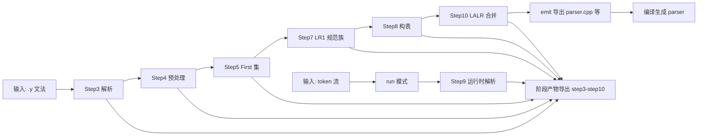

# YACC部分课程设计汇报

编译原理课程实践

<div class="mt-8 text-lg opacity-80">
  主题：C99子集语法分析器（LR(1)/LALR）
</div>

<div class="mt-8 text-lg opacity-80">
  71123226 于悦
</div>

---

# 目录

1. 编译对象与功能
2. 主要特色
3. 设计方案（Step1~Step10）
4. 使用说明（SeuLex / SeuYacc）
5. 测试与结果分析
6. AI协作模块
7. 总结与改进

---
layout: center
---

# 1. 编译对象与功能

---

# 编译对象
该系统解析的对象为 **任意符合当前支持子集的 YACC `.y` 文法 + 与该文法匹配的 token 流**  

- 可解析语法范围（由传入 `.y` 文法决定）
  - 声明与定义：基础类型、指针、初始化、多声明、函数定义/参数
  - 语句：复合语句、表达式语句、`if/else`、`switch`、`for/while/do`、`return/break/continue/goto`
  - 类型结构：`struct/union/enum` 的声明形态
- 支持的 YACC 文法能力
  - definitions：`%token %start %union %type %left/%right/%nonassoc %expect`
  - rules：`|`、`;`、`%prec`、`%empty`、动作块、mid-rule action
- 若输入 token 名称不在文法终结符集合内，或 `.y` 使用未支持指令，将在前置步骤拒绝并报错

---

# 编译对象
该系统解析的对象为 **任意符合当前支持子集的 YACC `.y` 文法 + 与该文法匹配的 token 流**  

- 可解析输入（运行时）
  - token 协议：`TOKEN` / `TOKEN LEXEME` / `TOKEN LEXEME LINE COLUMN`
  - 输入入口：`--parse-tokens`、`--parse-tokens-stdin`、`--from-lexer`
  - 终结符来源：`%token` 声明 + 字符字面量终结符（如 `'+'`、`';'`）

---

# 系统功能总览

- Step1-2：确定解析的 `.y` 文件格式
- Step3：`.y` 解析并建模为统一 `Grammar`
- Step4：文法预处理与增广
- Step5：First集与nullable计算
- Step6~Step7：LR(1)项集与规范族构造
- Step8：Action/Goto表构造与冲突消解
- Step9：运行时移进归约解析
- Step10：LR(1)→LALR(1)合并与重构，导出 `yacc_parse_main.cpp` 程序 

<br/>

> 全程支持分步导出到 `artifacts/yacc/stepX/`，供人工审查和后续可视化展示

---
layout: center
---

# 2. 主要特色

---

# 主要特色

- 分步可验证：Step1~Step10逐层校验，问题可精确定位
- 双轨语义保障：LR(1)作为正确性基准，LALR用于规模优化
- 冲突可解释：记录冲突位置、候选动作、最终决策与依据
- 可视化链路完整：算法产物可转换并前端展示
- 测试分层设计：回归、对拍、不变量、端到端协同验证

---
layout: center
---

# 3. 设计方案

---
layout: two-cols-header
---

# 总体架构（分层）

::left::

- 接口编排层（`src/tools/yacc_parse_main.cpp`）
  - 负责命令行解析、步骤调度、运行模式切换（`run/emit`）、导出控制
- 集成验证层
  - `tests/`：回归、对拍、不变量、端到端自动验证
  - `scripts/`：将 artifacts 转为前端友好数据格式
  - `visualizer/`：按 Step1~Step10 展示状态、表项、冲突和解析过程

::right::

- 核心算法层（`src/yacc/*`）
  - `model`：统一文法对象与索引体系
  - `parser`：把 `.y` 文本解析成 `Grammar`
  - `preprocess`：增广文法、补齐特殊符号、结构校验
  - `first`：计算 First/nullable，服务 lookahead 传播
  - `lr1`：构造 closure/goto 与 LR(1) 规范族状态机
  - `table`：生成 Action/Goto 表并处理冲突
  - `lalr`：按 LR(0) 核合并状态并重建表
  - `runtime`：移进-归约执行，输出 trace/reduction/error
  - `report`：分步工件落盘，供测试与可视化复用


---

# 总体流程（生成与运行双路径）



---

# Step1：输入范围定义

- 目标：建立可验证输入边界，避免隐式语法进入后续算法
- 机制：三层白名单门禁
  - definitions层：仅接收 `%token/%start/%union/%type/%left/%right/%nonassoc/%expect` 等
  - rules层：仅接收 `| ; %prec %empty action mid-rule-action`
  - token协议层：支持 `TOKEN` / `TOKEN LEXEME` / `TOKEN LEXEME LINE COLUMN`
- 错误策略：发现越界输入立即拒绝，不进入后续计算
- 价值：把“解析失败”前移到“输入契约失败”，降低排障成本

---

# Step2：内部数据结构设计

- 核心对象
  - `Symbol{id,name,kind,is_literal_char}`
  - `Production{id,lhs,rhs,action,prec_symbol,source_line}`
  - `Grammar{symbols,productions,indices,definitions_meta}`
- 索引约束
  - `symbol_id_by_name`：名称到ID映射，避免重复字符串比较
  - `prod_ids_by_lhs`：按左部快速取候选产生式，服务 closure
  - 特殊符号统一建模：`$`、`epsilon`、`S'`
- 稳定性设计：按出现顺序分配 ID，保证导出产物和测试快照可复现

---

# Step3：`.y` 解析与建模

- 五阶段流水
  - 分段识别：按 `%%` 划分 definitions / rules / user_subroutines
  - 声明解析：提取 `%token/%type/%union/优先级/expect` 等元信息
  - 规则解析：生成 `ProductionDraft`，暂存 `%prec`、动作块、行号
  - mid-rule改写：把中间动作改写为等价产生式形态
  - 对象固化：统一生成 `Grammar` 与稳定编号 `Production`
- 动作块读取：受控扫描字符串/字符/转义，避免 `}` 误闭合
- 产物：Step3 可导出完整 grammar 与 source_line 追踪信息

---

# Step4~Step5：预处理与 First 集

- Step4 文法预处理
  - 补齐特殊符号 `$`、`epsilon`、`S'`
  - 插入增广产生式 `S' -> S`（固定索引约定）
  - 重建 `prod_ids_by_lhs`，执行起始符/引用一致性校验
- Step5 First 集计算
  - 不动点迭代：`FIRST` 或 nullable 变化即继续
  - 终结符初始化 `FIRST(t)={t}`，非终结符从空集起步
  - 同时提供 `FIRST(符号串)` 供 Step6 closure 按需调用
- 收益：Step6/7 可直接复用 First 结果，避免重复大迭代

---

# Step6~Step7：LR(1)状态机构造

- Step6 I0 / closure / goto(I0, X)
  - 起点项：`[S' -> ·S, $]`
  - closure规则：对 `[A -> α·Bβ, a]`，按 `FIRST(βa)` 传播 lookahead
  - 工程实现：队列增量展开 + `(prod,dot,lookahead)` 判重键
  - 输出：I0闭包、首层 goto 集合、lookahead 推导说明
- Step7 LR(1)规范族
  - BFS 扩展全部可达状态
  - 规范化项集键（排序串联）用于稳定判重
  - 仅复用已存在状态编号，不复制状态实体，避免状态爆炸
  - 输出：`states`、`transitions`、目标项集键用于复核

---

# Step8：Action/Goto 构表与冲突消解

- 填表规则
  - `[A->α·aβ,b]` 且 `a` 终结符 -> `Action[i,a]=Shift`
  - `[A->α·,a]` 且 `A!=S'` -> `Action[i,a]=Reduce`
  - `[S'->S·,$]` -> `Action[i,$]=Accept`
  - `goto(i,A)=j` -> `Goto[i,A]=j`
- 冲突处理
  - 统一“候选动作归并器”处理 sr/rr 冲突
  - 先按优先级/结合性决策，再按稳定回退规则兜底
  - 记录 `conflicts + conflict_resolution_logs`，保证可追溯

---

# Step9~Step10：运行时与LALR优化

- Step9 运行时解析
  - LR driver：`state_stack + symbol_stack + input_ptr`
  - reduce时按 RHS 长度弹栈，再查 `Goto[top, A]` 回填状态
  - 每步写 trace：状态、前瞻符、动作、栈快照
  - error时提取“当前状态可接受终结符集合”用于诊断
  - 产物：`accepted`、`reduction_ids`、`trace_rows`、`error`、可选 AST/IR
- Step10 LR(1) -> LALR(1)
  - 按 LR(0) 核分组，组内 lookahead 并集
  - 构建 `lr1_to_lalr_state_id` 映射并重建转移
  - 重新构表并重新统计冲突，不直接复用 LR1 表
  - 产物：`merge_groups`、LALR 状态机/表、状态压缩统计

---
layout: center
---

# 4. 使用说明

---

# SeuYacc常用命令

```bash
# 构建
cmake -S . -B build
cmake --build build -j

# 执行Step3~Step10并导出
./build/src/yacc_parse_tool c99.y --export

# 带token运行Step9
./build/src/yacc_parse_tool c99.y \
  --parse-tokens contracts/yacc/tokens/c99_func_param_return.tokens --export

# 生成器路径
./build/src/yacc_parse_tool emit c99.y --emit-parser-cpp tests/out/generated_parser.cpp
```

---

# 与词法联调（SeuLex）

- 词法职责：将C源码转换为token序列
- 语法与词法解耦，仅依赖token协议
- 推荐：token中保留 `LEXEME LINE COLUMN` 以提升错误定位
- 直连入口示例：

```bash
./build/src/yacc_parse_tool run c99.y \
  --from-lexer contracts/yacc/tokens/c99_decl_int.tokens
```

---
layout: center
---

# 5. 测试与结果

---

# 测试体系（分层）

- 回归层（Test1）：golden快照比对 accept/reduce/trace/error
- 外部一致性层（Test2/2f/7）：与bison对拍
- 内部不变量层（Test3/4/5/6）：表与trace机制正确性
- 扩展/端到端层（Test8/9）：特性支持与工程链路验证

统一执行：

```bash
python3 tests/run_yacc_tests.py --tests 1,2,2f,3,4,5,6,7,8,9
```

---

# 关键结果

- 状态规模压缩（Step10）
  - `lr1_states = 1855`
  - `lalr_states = 399`
  - `state_merged = 1456`
- 运行一致性（`c99_func_param_return.tokens`）
  - `lr1_parse_accepted = true`
  - `lalr_parse_accepted = true`
  - 解析步数一致：49步
  - 规约次数一致：37次

---

# 可证明结论

- 结论1：功能正确
  - 合法输入可接受，非法输入可拒绝
- 结论2：机制正确
  - 状态机、分析表、trace满足LR不变量
- 结论3：语义对齐
  - 与bison关键行为一致
- 结论4：工程可交付
  - `run` / `emit` / AST/IR / 可视化链路完整

---
layout: center
---

# 6. AI协作模块

---

# 如何与 AI 协作完成完整项目


- 协作流程（闭环驱动）
  - 目标定义：先拆 Step1~Step10，再逐步落地
  - 约束下发：限定目录、语言、模块、不可修改边界
  - 证据验收：每轮都要求“命令 + 日志 + 结果”可复现
- 人机分工（职责清晰）
  - 我负责：目标、边界、验收口径、问题裁决
  - AI负责：代码实现、重构、测试脚本、文档与可视化
- 质量保障（多重验证）
  - Golden 回归 + Bison 严格对拍
  - LALR 状态机/表项/冲突/trace 不变量联合校验
  - 失败后基于日志定位，修复后回归，直到稳定通过

<br/>

> 核心经验：不让 AI “一次写完”，而是通过“约束 + 证据 + 回归”把结果逐轮逼近正确。


---
layout: center
---

# 7. 总结与改进

---

# 课程设计总结

- 完成了YACC子系统从文法输入到可执行分析器的闭环实现
- 建立统一模型与步骤化导出，结果可追踪、可复算
- 构建了工程化命令入口与分层测试体系
- 可视化能力增强了调试、复盘与答辩解释效率

---

# 局限与后续计划

- 当前覆盖以课程子集为主，大规模C99语料仍需扩展
- 复杂语义动作与AST/IR一致性可继续加强
- 需要建立完整性能基线（构表耗时、规模曲线、解析吞吐）
- 错误恢复目前以首错报告为主，可增强多错误恢复能力

---
layout: center
class: text-center
---

# 谢谢

欢迎提问

<div class="mt-8 text-sm opacity-60">
  附：可现场演示 `run` / `emit` / 可视化页面
</div>
